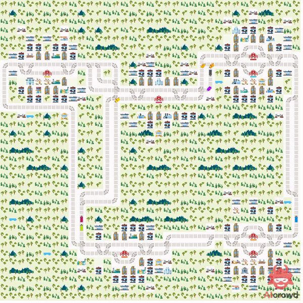

# RL robust to deadlocks for the Flatland Challenge 2020

Contains approaches for the Flatland-Challenge 2020: https://www.aicrowd.com/challenges/neurips-2020-flatland-challenge

Included are implementations and evaluations of path-reservation algorithms combined with RL-agents and compared to baselines.

## References

This repository makes extensive use of source-code from the following origins. Licences are included.

[1] https://gitlab.aicrowd.com/flatland/neurips2020-flatland-baselines

